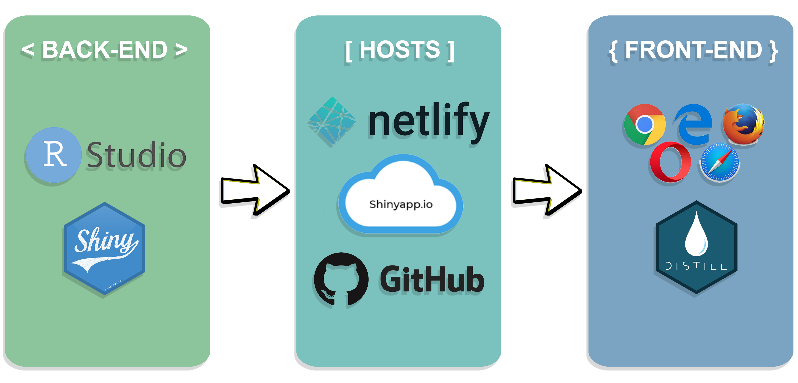
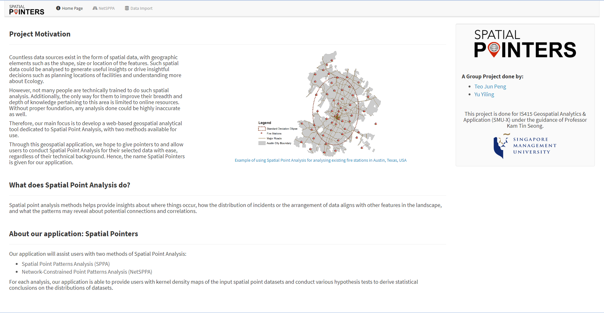

```{r setup, include=FALSE}
knitr::opts_chunk$set(echo = FALSE)
```

# Problem & Motivation

Countless data sources exist in the form of spatial data, with geographic elements such as the shape, size or location of the features. Such spatial data could be analysed to generate useful insights or drive insightful decisions such as planning locations of facilities and understanding more about Ecology.

However, not many people are technically trained to do such spatial analysis. Additionally, the only way for them to improve their breadth and depth of knowledge pertaining to this area is limited to online resources. Without proper foundation, any analysis done could be highly inaccurate as well.

**Therefore, our main focus is to develop a web-based geospatial analytical tool dedicated to Spatial Point Analysis, with two methods available for use.**

Through this geospatial application, we hope to give pointers to and allow users to conduct Spatial Point Analysis for their selected data with ease, regardless of their technical background. Hence, the name Spatial Pointers is given for our application.

<!-- ## Objectives -->

<!-- In this project, we would like to create an analytical application that enables users to: -->

<!-- 1. Better understand the capabilities and use cases of Spatial Point Analysis -->
<!-- 2. Conduct Spatial Point Patterns Analysis (Kernel density estimation and G/F/Cross-L functions) -->
<!-- 3. Conduct Network-Constrained Point Patterns Analysis (Point density estimation and K/Cross-K functions) -->
<!-- 4. Use insights derived from the analysis for better decision making -->

# Approach

## **Data Collection**

We collated several data sets to be used as sample use cases for our application, such as the **locations of McDonalds' outlets in Singapore** and **MRT Stations in Punggol, Singapore**. The wide range of data consists of both CSV and Shapefile formats.

## **Data Wrangling**

We checked through the respective data sets and ran Exploratory Data Analysis (EDA) with them to check for any outliers and anomalies in the data. For **Spatial Point Patterns Analysis**, the data was good and everything ran without issues. Unfortunately for **Network-Constrained Point Patterns Analysis**, the initial data sets had issues which could hinder our application, hence an alternative data set was used instead, which enabled the process to continue smoothly. 

## **Application Architecture**

```{r, out.width='70%', fig.align="center"}

```

# Overview of Spatial Pointers

```{r, out.width='70%', fig.align="center"}
knitr::include_graphics("Images/App_Logo_.png")
```

**1. Home Page**

```{r, out.width='100%', fig.align="center"}

```

**2. Spatial Point Patterns Analysis (SPPA)**

**3. Network Constrained Spatial Point Patterns Analysis (NetSPPA)**

**4. Data Import**

Usually you want to have a nice table displaying some important results that you have calculated. In `posterdown` this is as easy as using the `kable` table formatting you are probably use to as per typical R Markdown formatting.

You can reference tables like so: Table \@ref(tab:mytable). Lorem ipsum dolor sit amet, consectetur adipiscing elit. Aliquam placerat augue at velit tincidunt semper. Donec elementum porta posuere. Nullam interdum, odio at tincidunt feugiat, turpis nisi blandit eros, eu posuere risus felis non quam. Nam eget lorem odio. Duis et aliquet orci. Phasellus nec viverra est.

# ```{r mytable, out.width='80%'}
# knitr::kable(iris[1:10, 1:4], caption = 'Table caption.',align = 'c',"html")
# ```

Or with figures: Figure \@ref(fig:standard-plot), or Figure \@ref(fig:morefigs).

# ```{r standard-plot, out.width='80%', fig.align='center', fig.cap='Great figure!', fig.height=5}
# plot(mtcars[1:2])
# ```
# 


# Future Work

Further improvements could be made to the application, such as:

**1. Enabling a more generic Data Import function**
- Currently for NetSPPA, the function is only limited for point data within the boundaries of Punggol, Singapore. In future, the function should allow for importing of the **user's own Network and Point dataset** so they could run their analysis at their location of choice.

# Conclusion

Try `posterdown` out! Hopefully you like it!

```{r, include=FALSE}
knitr::write_bib(c('knitr','rmarkdown','posterdown','pagedown'), 'packages.bib')
```
